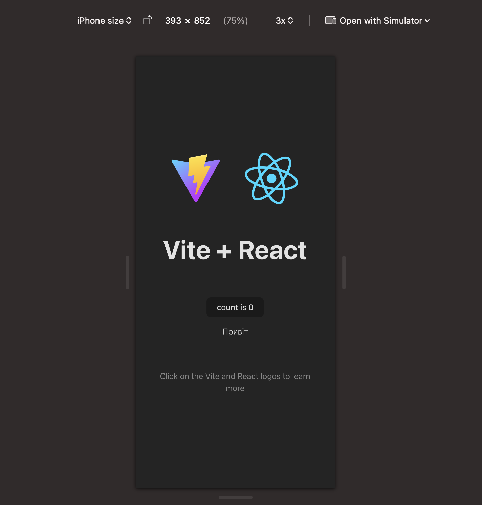

# VIN decoder front-end application for ABP during the selection stage

## Server

You can check the working application [here](http://localhost:5173) (http://localhost:5173)

## Local installation

Clone the repository to your local environment

```bash
$ git clone https://github.com/mykhailo11/abp-testtask-vin-decoder
$ cd abp-testtask-vin-decoder
```

Start the development server

```bash
$ npm install
$ npm run dev
```

## Important notes

- In production it is better to use Next JS or other frameworks on top of React that allows SSR / SSG / SSI in order to improve user's experience, application performance and SEO
- I won't use any styling frameworks like Bootstrap or Tailwind CSS as it is not allowed by the task definition, but for the real-world scenario it is better to use them as they prevent "reinventing the wheel" and reduces time needed for development
- The same is applicable for component libraries which ensures consistent design accross the application
- Images will be stored as static resources, but for better flexibility it is better to create CDN
- Also it is better to cover the functionality with tests

## Application details

For better import management I have created additional vite configuration (vite.config.ts) to create an import alias (@):

```js
export default defineConfig({
  ...
  resolve: {
    alias: { '@': path.resolve(__dirname, './src'), },
  },
  ...
})
```

TypeScript configuration (app specific configuration file - tsconfig.app.json):

```js
...
"compilerOptions": {
  "paths": {
    "@/*": ["./src/*"]
  }
}
...
```

Also created a global {root}/src/variables.scss and {root}/src/common.scss files to be imported across the application to store pre-defined styles in vite.config.json:
```js
...
css: {
  preprocessorOptions: {
    scss: {
      additionalData: `@use "@/variables.scss" as *; @use "@/common.scss";`
    }
  }
}
...
```

Some of the dependencies I would like to use:

- Instead of hardcoding the content strings I prefer using i18n. First install the dependencies:
  ```bash

  # i18next - base implementation
  # react-i18next - react integration
  # i18next-browser-languagedetector - automatic language detection
  # i18next-http-backend - configuration is stored as a static resource

  $ npm install i18next react-i18next i18next-browser-languagedetector i18next-http-backend
  ```
  Then created a configuration file in the {root}/src/config/localization.ts. After that you can store you language constants in the {root}/public/locales:
  ```
  /locales
  -- /en
  ---- /translation.json
  -- /ua
  ---- /translation.json
  ```
- I'm using SASS CSS pre-processor (dev dependency) for better styling management. You can use the following dependency for faster performance with MacOS / Linux / Windows
  ```bash
  $ npm install -D sass-embedded
  ```
  or for any other operating system with Node JS installed
  ```bash
  $ npm install -D sass
  ```
- React Router DOM library is used to add routing feature
  ```bash
  $ npm install react-router-dom
  ```
- For complex state management I'm gonna Zustand
  ```
  $ npm install zustand
  ```

Added some metadata in order for the application to be listed in the search (not sure if it will work with SPA)
```html
...
<meta name="description" content="VIN decoder front-end application for ABP during the selection stage" />
<meta name="robots" content="index, follow" />
...
```

Best practices suggest using mobile-first approach, so I used Safari's feature "Develop -> Enter Responsive Design Mode"



Also there is support for both dark and light themes

Created a shared `<Layout/>` component which renders header and `<Outlet/>` coming from the `<BrowserRouter>`\
\
There is no backend for storing history, so there are two options to persist values: local storage or context. I decided to use local storage.

```js
import type { ValueBunlde } from "@/types/types";
import { useCallback, useEffect, useState } from "react";

type Props = {
    key: string
}

function useLocalSorage<some>({ key }: Props): ValueBunlde<some> {
  const [current, setCurrent] = useState<some>();
  useEffect(() => {
    const value: string | null = localStorage.getItem(key);
    if (!value) {
      return;
    }
    try {
      const parsedHistory: some = JSON.parse(value);
      setCurrent(parsedHistory);
    } catch {
      localStorage.removeItem(key);
    }
  }, [key]);

  const setValue: (value: some | undefined) => void = useCallback(
    (value: some | undefined) => {
        setCurrent(value);
        localStorage.setItem(key, JSON.stringify(value));
    },
    [key]
  );

  return {
    value: current,
    setValue: setValue
  };
};

export default useLocalSorage;
```

### Home page

Created a responsive home layout using CSS grid system:
```css
.home-layout {
    display: grid;
    width: 100%;
    align-items: start;
    grid-template-rows: repeat(3, auto);
    grid-template-columns: auto;

    .vin-code-history {
        grid-row-start: 2;
    }

    @media screen and (min-width: #{$min-content-threshold}px) {

        grid-template-rows: auto 1fr;
        grid-template-columns: auto;
        max-width: 300px;
        
        &:has(.vin-code-info) {
            grid-template-columns: auto 1fr;
            max-width: 1000px;
        }

        .vin-code-info {
            align-self: stretch;
            justify-self: stretch;
            grid-column: 2;
            grid-row: 1 / 3;
        }
    }

}
```

Here user can enter a VIN code value, which will be validated against different rules (length, characters etc). After user clicks search, a new history record is created (it can be reused) and information for the provided value is displayed. If API call receives errors, they are formatted and displayed, othervise key-value pairs are presented to the user (except the empty ones).


